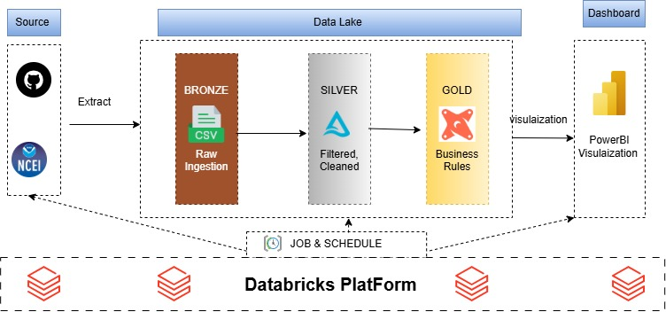

# GHCN Weather Databricks Architecture
<h3><b>(Manual VS Lakeflow Pipeline)</b></h3>


## END-to-End pipeline with databricks

📌Project OverView:
Weather conditions heavily influence on urban engineers decisions and managdment. This project builds an automated data platform using databricks that ingests raw data from the National Centers for Environmental Information (NCEI / NOAA) into a landing volume , then transfer to bronze layer to convert data raw to delta lake tables . In the silver layer, delta tables undergo  cleaning and filtering while in gold layer, dbt is leveraged for data transformation according to business rules.I previously did end-to-end batch pipeline for GHCN weather dataset including business metrics and  powerBI dashboard (https://github.com/melikakh2024/pipline-weather).
In this project rather than focusing  on visulization business metrics , I shed light on  comparison between building lakeflow (declarative pipeline  versus manual pipeline)


🛠️ Tech Stack:

|Layer|Manuall|Lakeflow(Declarative)|Purpose|
|---|---|---|---|
|ingestion|Python 3.10+ & requests | Python 3.10 & requests| Modular scripts , metadata lineage, retry logic|
|orchastration|job in databricks|automatically handle (without scheduling settings) |Defining tasks, jobs, failure  alerts |
|Data lake|Using medallion approach in databricks|Using medallion approach in databricks|Storing raw data,filtering and cleaning data, business rules|
|Transformation| DBT in gold layer | DBT in gold layer|Modular SQL modeling, lineage tracking, and schema documentation
|Data Qulaity| DBT | dbt + defining constraints and expectations in Silver layer| Automated uniqueness, non-null, relationship tests, accepted values via dbt, and declarative constraints|
|Infrastructure| Databricks|Databricks|Unified platform|


## Engineering Decisions in pipline Architucture:

```
Ingest layer:
Implemented modular Python code to send HTTP requests and identify new data by inspecting HTTP headers.

bronze layer:
The main goal of this layer is to preserve raw source data. Columns are generally stored as strings, and metadata such as the file path, modification time, and ingestion time is added.

 - In the manual implementation, I used Auto Loader for incremental streaming ingestion of the weather dataset. The countries and stations datasets, which change infrequently, were ingested using batch processing and stored in Delta tables.

 - In the declarative implementation, I used a streaming table for incremental ingestion of the weather dataset. The countries and stations datasets, which change infrequently, were processed using materialized views. The data was stored in Delta tables.

Silver layer:
The main goal of this layer is to filter, validate, and clean the dataset
 - In the manual implementation, I used PySpark to filter the data and convert columns to appropriate data types.
 - In the declarative implementation, I used SQL-based data quality expectations and constraints, along with filtering and data type conversions.

Gold Layer:
The main goal of this layer is to apply business rules and calculate business metrics.
 - In the manual implementation, I used dbt to transform the cleaned data into analytical models.
 - In the declarative implementation, dbt is intended to transform the new Silver tables into analytical models

Job and Scheduling layer:
- In the manual implementation, the processing steps were managed through individual notebooks and explicit execution logic. I defined three tasks for the Bronze layer, configured dependencies for the Silver layer, and connected the Silver layer to dbt.

- In the declarative implementation, Lakeflow Declarative Pipelines automatically manages the execution and dependencies of the defined transformations within the pipeline.


 ```
📂 Project Structure
```
end-to-end-data-pipeline/
├── landing/
│   └── landing_weather.ipynb
├── bronze/
│   ├── manual/
│   │   ├── bronze_stations.ipynb
│   │   ├── bronze_countries.ipynb
│   │   └── bronze_autoloader.ipynb
│   └── declarative/
│       └── declarative_bronze.ipynb
├── silver/
│   ├── manual/
│   │   ├── silver_stations.ipynb
│   │   ├── silver_countries.ipynb
│   │   └── silver_years.ipynb
│   └── declarative/
│       └── declarative_silver.ipynb
└── dbt/
    ├── dbt_project.yml
    └── models/
        ├── staging/
        └── mart/
```

🚀 Quick Start (Run Locally in 3 Steps)
```
 - Create a free Databricks account and sign in.

 - Open your Databricks workspace.

 - Import the project notebooks and SQL files.
````


